# 综合结论 — 业界主流做法与 Neeko 单测执行演进路线

> 调研日期：2026-09-05。依据：`test-execution-vscode-jetbrains.md`、`test-execution-zed-others.md`（含全部一手来源）、Neeko 现状（`prd.md` / `implement.md`：M1 检测、M2 gutter 菜单、M3 Task Console 运行、M4 Rust debug）。
> 性质：调研产出，不含代码改动；下述路线为建议，落地前需走 PRD/设计评审。

---

## 1. 业界主流做法（一段话结论）

四家产品在测试执行上的收敛点惊人一致：**发现**靠编辑器/IDE 侧的语义分析（VS Code 交给扩展、JetBrains 用 PSI/macro、rust-analyzer 用编译器语义；纯文本正则只存在于 Zed 这种"无测试 UI"的产品里）；**执行**上 Run 与 Debug 共享同一入口（VS Code 的 TestRunProfileKind / JetBrains 的 Executor / Zed 的 task vs debug scenario），且 Debug 一律走"构建测试二进制 → 以测试过滤参数为 args 启动调试器"（rust-analyzer `debug.ts`、intellij-rust `RsAsyncRunner`、Zed build task、Neeko M4 四者同构）；**结果回传**全部收敛到"框架的结构化输出 → IDE 统一用例状态机"——Rust 生态事实标准是 **libtest JSON**（rust-analyzer 与 JetBrains 两家消费同一协议），TS 生态是 **JSON reporter**（vitest 官方建议写文件消费）；**展示**上 gutter 图标承担"入口 + 上次状态"双重职责（JetBrains 绿/红图标、VS Code gutter 状态、Zed runnable），树形 Explorer 是锦上添花而非必需（Zed 完全没有也成立）。

```mermaid
flowchart LR
    subgraph Discovery["发现（语义层）"]
        A1["VS Code: 扩展自治<br/>watcher+懒resolve"]
        A2["JetBrains: PSI+macro+producer"]
        A3["rust-analyzer: 编译器语义<br/>experimental/discoverTest"]
    end
    subgraph Exec["执行（Run/Debug 同入口）"]
        B1["Run: cargo test --format=json<br/>vitest run --reporter=json"]
        B2["Debug: build --no-run → 测试二进制<br/>→ DAP launch(program, args=过滤)"]
    end
    subgraph Feedback["回传（结构化协议）"]
        C1[libtest JSON Lines]
        C2[vitest JSON 文件]
        C3[JetBrains service messages]
    end
    subgraph UI["展示"]
        D1[gutter: 入口+✓/✗状态]
        D2[测试树/Explorer]
        D3[失败行内 overlay]
    end
    Discovery --> Exec --> Feedback --> UI
```

---

## 2. Neeko 现状 vs 业界对照

| 环节 | 业界做法 | Neeko 现状 | 差距定性 |
|---|---|---|---|
| 发现 | 语义级（属性/macro 展开、AST） | 文本扫描（`#[test]`/`fn` 行、`test('/`it(' 行，纯函数） | 可接受的 MVP 权衡：vitest 名字是运行时字符串（文本即真相）；Rust macro 展开缺失但有子串过滤兜底 |
| 入口 | gutter 图标 = 入口 + 状态 | gutter play 图标 + Run/Debug 菜单（已有 GutterContribution 注册表） | 入口形态已对齐；**缺状态回显** |
| Run 执行 | 结构化协议跑（libtest JSON / JSON reporter） | `cargo test <name>` / `pnpm vitest run <f> -t <name>` 裸跑，输出进 Task Console | **主要差距**：无用例级 ✓/✗ |
| 结果状态 | 统一用例状态机 → 树/gutter/overlay | 无（Task Console 人类可读输出） | 同上 |
| Debug | build --no-run → 二进制 → DAP | `cargo test <name> --no-run` → **stdout 文本解析** `Executable unittests ...` 行 → lldb launch(program, args) | 链路对齐业界；**二进制解析手段**比 JetBrains 的 `--message-format=json` 脆弱 |
| Explorer | 树形面板（VS Code/JetBrains 有，Zed 无） | 无 | 锦上添花项 |

**Neeko 独有优势**：MVP 直接继承了 agent-chat 任务里沉淀的任务会话基建（`taskStore.runTask` 的 `onOutput`/`onExit` 观察者 + runId），等价于 VS Code TestRun 的最小回传通道——只是目前只传"原始文本"，没传"结构"。

---

## 3. 演进路线（按投入/收益排序）

### P1（强烈建议，下一步最优）：结构化结果流 → 用例级 ✓/✗ 装饰

**收益最高**：业界两家 Rust 消费方证明 libtest JSON 是现成的、双向验证过的协议；TS 侧 vitest 官方 reporter 开箱即用；Neeko 侧消费端（gutter 贡献注册表 + onOutput/onExit 观察者）都已就位。

- **Rust**：命令追加 `--show-output` 与 `-Z unstable-options --format=json`（`cargo test <name> -- -Z unstable-options --format=json --show-output`；rust-analyzer `test_runner.rs:66` 用 `RUSTC_BOOTSTRAP=1` 让 stable 支持 `-Z`，intellij-rust 按 rustc ≥1.70-beta 门控并告警——Neeko 需做同一决策，建议先按 rust-analyzer 无条件注入的方案，失败回退裸跑）。
- **TS**：`--reporter=default --reporter=json --outputFile=<临时文件>`（组合 reporter 官方支持）：default 进 Task Console 保持人类可读，json 文件在 `onExit` 后读取解析。**不要用 `stdout: true`**——官方 WARNING：stdout 报告会与终端输出混流导致不可解析。
- **新增纯函数解析器**（对齐 `testCases.ts` 的形态与 TDD 约束）：`parseLibtestJsonLines(text) -> TestResultEvent[]`（逐行 JSON，非 JSON 行丢弃——与 rust-analyzer 的降级策略一致）、`parseVitestJsonReport(json) -> TestCaseResult[]`。
- **状态模型**：按 `项目+文件+用例名` 记录 `{ status: passed|failed|ignored, duration?, message? }`；文件编辑后对应用例结果标记过期（`invalidateTestResults` 的最小仿制）。
- **展示**：新增一个 `test-status` GutterContribution（注册表架构下零改合并器；同行冲突规则沿用：有 play 的行状态图标让位/并列）。失败信息走 hover/行内 overlay（VS Code 形态）留作子项。
- **已知坑**（协议调研实证）：① libtest 输出是扁平全限定名，源码侧 `parseTestCases` 只有 fn 名 → 按"名后缀匹配"对齐（与 R3 子串过滤同语义）；② 参数化测试产生运行时名，无法对回源码行 → 标记为 unknown/obsolete，不猜；③ vitest `describe` 前缀同理按后缀匹配；④ `-t` 过滤下 `suite.filtered_out` 字段可用于确认命令命中。

### P2（小改动，顺手做）：Debug 二进制解析换 JSON 构建消息

- 现状解析 stdout `Executable unittests ...` 行（`parseTestBinaryPath`，2MB 上限）在多二进制/路径含空格时已显脆弱（implement.md 记录了 sourceHint 补丁）。
- 业界做法：`cargo test <name> --no-run --message-format=json`，取 `{"reason":"compiler-artifact","executable":"...","target":{...}}`（intellij-rust legacy runner 的捕获方案；现代路径用 build 窗口的 CompilerArtifactMessage，同一数据源）。
- 迁移：仍是纯函数（`parseCargoArtifactExecutable(lines)`），JSON 行过滤后取最后一个 executable 匹配 target 名；Task Console 仍显示原始构建输出。lldb DAP 链路（已与 rust-analyzer/Zed/JetBrains 同构）不动。

### P3（延后，等 P1 的数据模型免费长出来）：测试树/Explorer 面板

- P1 之后的用例状态存储天然就是 Explorer 的数据源；届时的成本只是 UI。
- 首版形态建议收窄：**文件级**（当前打开文件的用例列表 + 状态 + 失败信息），不做全工作区树——Zed 的取舍证明无树也可用，VS Code 的树价值随测试数量增长。
- 触发条件（满足其一再做）：用户反馈跨文件跑/重跑失败的需求；P1 状态模型稳定运行一段时间。

### 明确不做（过度设计 / 协议调研实证的负收益）

| 不做 | 理由 |
|---|---|
| VS Code 式 RunProfile/Capabilities 机制 | Run/Debug 两态已在 gutter 菜单闭环；抽象无第三个消费者（YAGNI） |
| JetBrains service message 中间层 | 那是 JetBrains 为"多框架复用统一 wire"付出的代价；Neeko 每栈直连各自原生协议（libtest/vitest JSON）更短 |
| 覆盖率（FileCoverage/loadDetailedCoverage 全链） | 独立大特性，与本任务无关 |
| Continuous testing（保存即跑） | VS Code `supportsContinuousRun` 语义；需要任务调度/取消风暴处理，价值未验证 |
| LSP 测试协议 / `experimental/*` 扩展 | Neeko 测试栈不经语言服务器；私有协议只适合本来就有 LSP 的架构 |
| Test Adapter 兼容层 | VS Code 已废弃的旧 Test Explorer UI API（guide 的 Migrating 章节），无接入价值 |

---

## 4. 对照 `.trellis/spec` 约束的合规性检查

| 约束（spec/AGENTS.md） | 路线对齐方式 |
|---|---|
| TDD Red-Green-Refactor（unit-test/index.md） | P1 两个解析器、P2 artifact 解析器均为纯函数（P0 测试优先级：纯函数零依赖），先写失败测试 |
| 不引入新 npm/Cargo 依赖 | JSON 解析用 `JSON.parse`/serde_json（既有）；无新 reporter 包（vitest 内建 `--reporter=json`） |
| 前端不直接 invoke，走 feature api 门面（frontend/api-layer.md） | 结果回传复用既有任务会话观察者（`runTask` 的 onOutput/onExit），不新增 IPC 命令/事件通道；若未来拆独立长跑会话，事件名走常量（`AGENT_CHAT_EVENT` 先例） |
| IPC 大文本 <2MB（红线 4） | libtest JSON 为逐行流式，天然小；vitest 报告文件按需读取（P1 设计需对大报告设上限/截断，沿用 parseTestBinaryPath 的 2MB 先例） |
| 统一执行门面 / 前端经任务会话（红线 1/2） | 不新增任何进程 spawn；命令构造仍走 `testCommands.ts` 纯函数 + 任务会话 |
| 性能：防抖 + 惰性 decoration（prd R5） | 状态写入按 run 生命周期批处理；gutter 状态贡献走注册表（markersOf 惰性、`eq` 值比较已由 P4 重构保障） |
| 跨 feature 门面（防火墙） | 状态 store 若跨 editor/task 消费，经 feature index.ts 导出（gutter 贡献架构已示范） |

---

## 5. 最终回答

- **业界主流做法**：发现靠语义、执行 Run/Debug 同入口、回传靠框架结构化输出（Rust=libtest JSON，TS=JSON reporter）、展示以 gutter 入口+状态为核心、Debug 统一"构建二进制→DAP"。
- **Neeko 下一步最优路径**：**P1 结构化结果流**（Rust 加 `-Z unstable-options --format=json --show-output` + RUSTC_BOOTSTRAP=1；TS 组合 reporter + outputFile；两个纯函数解析器 + 用例状态 store + 一个新 GutterContribution）→ **P2 debug 二进制解析换 `--message-format=json`**（顺手加固）→ **P3 文件级测试列表**（等数据模型成熟）→ 不做 profile 抽象/中间协议层/覆盖率/持续测试。
- 一句话：Neeko 当前 MVP 与 Zed 同级（入口+命令+终端），离 VS Code/JetBrains 一档之差，差的不是 UI 而是那**一条结构化结果流**——补上它，✓/✗ 装饰、失败信息、Explorer 都是从同一数据模型上长出来的。
