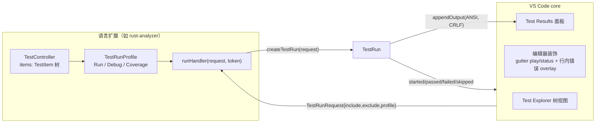
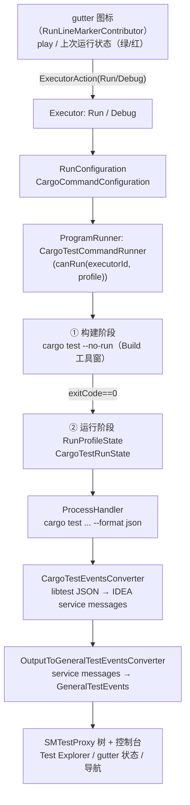

# 测试执行架构调研 — VS Code 与 JetBrains（IntelliJ/RustRover）

> 调研日期：2026-09-05。范围：测试**发现、执行、结果回传、展示**的完整链路（与 `vscode-gutter-codelens.md` / `jetbrains-gutter-linemarkers.md` 的"渲染层"调研互补，本文聚焦"执行层"）。
> 一手来源：`vscode.d.ts`（本地 `/tmp/vscode.d.ts`，microsoft/vscode main）、VS Code 官方 Testing 文档、rust-analyzer 源码（master）、intellij-community 源码（master）、intellij-rust 源码（master）。

---

## 1. VS Code

### 1.1 核心架构：TestController 三件套

VS Code 的测试能力是**平台内建的测试域**（`vscode.tests`），语言扩展通过 Test Controller API 接入。API 表面（`vscode.d.ts:18290-19161`）：

| API | 职责 | 关键成员 |
|---|---|---|
| `TestController`（`vscode.d.ts:18449`） | 测试树的容器与执行入口 | `items`（TestItem 树）、`createRunProfile`、`resolveHandler`、`refreshHandler`、`createTestRun`、`invalidateTestResults` |
| `TestRunProfile`（`vscode.d.ts:18327`） | 一种执行方式 | `kind: TestRunProfileKind`（**Run / Debug / Coverage 三枚举**，`vscode.d.ts:18290`）、`runHandler`、`tag`、`configureHandler`、`supportsContinuousRun` |
| `TestRun`（`vscode.d.ts:18648`） | 一次运行的回传句柄 | `enqueued/started/skipped/passed/failed/errored`（逐用例状态机）、`appendOutput`、`addCoverage`、`end()`、`token`（取消）、`onDidDispose` |
| `TestItem`（`vscode.d.ts:18794`） | 树节点（用例/套件/文件） | `id`、`uri`、`range`、`children`、`canResolveChildren`、`tags` |
| `TestMessage`（`vscode.d.ts:18911`） | 失败详情 | `message`、`expectedOutput/actualOutput`（**diff 视图**）、`static diff()`、`location`、`stackTrace`（`TestMessageStackFrame`） |



- **Run/Debug 同入口不同 profile**：`createRunProfile('Run', TestRunProfileKind.Run, ...)` 与 `createRunProfile('Debug', TestRunProfileKind.Debug, ...)` 共用同一个 controller 与 TestItem 树；debug profile 的 runHandler 内部转调调试 API。官方指南原文："Each profile belongs to a specific execution kind: run, debug, or coverage."（[Testing API guide](https://code.visualstudio.com/api/extension-guides/testing)）
- **结果回传是纯 API 调用**：扩展在 runHandler 中逐用例调 `run.passed(item, duration)` / `run.failed(item, TestMessage)`；core 负责把状态扩散到 Test Explorer 树、gutter 状态图标、行内错误 overlay（[用户文档](https://code.visualstudio.com/docs/debugtest/testing)："the editor gutter and tree view display the corresponding test status (passed/failed)"）。
- **取消**：`TestRun.token`（CancellationToken）+ UI 取消按钮；`run.end()` 收尾，未更新的用例状态重置。
- **输出流**：`run.appendOutput(output, location?, test?)` 输出到 **Test Results 面板/终端**（"Test: Show Output"），支持 ANSI，换行必须 CRLF；可按 `location`/`test` 关联输出与用例（`vscode.d.ts:18716`）。注：指南提到输出也可经 Task 体系运行测试，但 **"tasks don't have special integration into VS Code's testing functionality"** —— Task 输出不更新测试 UI（[用户文档 Task integration 节](https://code.visualstudio.com/docs/debugtest/testing)），测试域与 Task 域是平行体系。[INFERENCE] core 内部把进程控制台输出复制进测试输出的机制（DuplicatedConsole）未在公共 API 暴露，公共契约只有 `appendOutput`。

### 1.2 发现时机：扩展自治，三段式

官方指南明确：**"it's mostly up to the extension to control when tests are discovered"**（[Testing API guide](https://code.visualstudio.com/api/extension-guides/testing#_discovering-tests)）。推荐组合拳：

1. **打开文件时**：监听 `workspace.onDidOpenTextDocument` / `onDidChangeTextDocument`，解析当前文档；
2. **懒解析**：`item.canResolveChildren = true` + `controller.resolveHandler`——用户在 Test Explorer 展开节点 / 首次打开面板时才深挖子节点（resolveHandler 以 `undefined` 调用 = 要求全工作区扫描）;
3. **文件 watcher**：`workspace.createFileSystemWatcher` 持续增量维护树（create/change/delete 三个事件对应增改删）；
4. **手动 refresh**：`controller.refreshHandler`（`vscode.d.ts:18520`）绑定 Test Explorer 的 Refresh 按钮；
5. **结果失效**：`controller.invalidateTestResults(items?)`（`vscode.d.ts:18573`）把用例标记为 outdated（对应源码改动后结果过期）。

即：**平台不负责发现，只提供「树 + 惰性 resolve + watcher + refresh」四个钩子**。这个设计让 Jest/Vitest/pytest/rust 各自用最合适的方式（AST、编译器、正则）发现测试。

### 1.3 rust-analyzer 的 Rust 测试执行实现（一手源码）

rust-analyzer 是"**语言服务器做发现与执行、VS Code 扩展做 UI 粘合**"的代表。

**发现**：不走 CodeLens（旧方式），走 **LSP 私有扩展协议**（`crates/rust-analyzer/src/lsp/ext.rs:200-318`）：

| 方法/通知 | 方向 | 载荷 |
|---|---|---|
| `experimental/discoverTest`（request） | 客户端→服务器 | `{ testId?: string }`，按节点懒发现 |
| `experimental/discoveredTests`（notification） | 服务器→客户端 | `DiscoverTestResults { tests: TestItem[], scope, scopeFile }`，增量推送 |
| `experimental/runTest`（request） | 客户端→服务器 | `{ include?, exclude? }`（TestItem id 数组） |
| `experimental/changeTestState`（notification） | 服务器→客户端 | `{ testId, state: Started/Passed/Failed{message}/Skipped/Enqueued }` |
| `experimental/appendOutputToRunTest` / `endRunTest` / `abortRunTest` | 服务器→客户端 | 原始输出 / 结束 / 取消 |

服务端 `TestItem`：`{ id, label, kind: Package|Module|Test, canResolveChildren, parent, textDocument, range, runnable }`。发现逻辑在 `crates/ide/src/runnables.rs`：`visit_file_defs` 遍历文件内定义，`#[test]`/`#[bench]` 属性（`has_test_related_attribute`）产出 `RunnableKind::Test { test_id }`；**macro 展开产物**（如 `#[tokio::test]` 生成的代码）通过 `in_macro_expansion` 聚合去重（`runnables.rs:130-152`）；另有 `related_tests()`（"Peek Related Tests"：对当前符号做 usage 搜索再过滤出测试函数，`runnables.rs:163-207`）。

**执行**：服务器端 `crates/rust-analyzer/src/test_runner.rs` spawn：

```text
cargo test --package <pkg> [--lib | --bin <target>] --no-fail-fast
  --manifest-path <root>/Cargo.toml -- <test_path> -Z unstable-options --format=json
```

- 命令行注释原文（`test_runner.rs:94`）：`cargo test --package my-package --bin my_bin --no-fail-fast -- module::func -Z unstable-options --format=json`；
- **RUSTC_BOOTSTRAP=1** 允许 stable 用 `-Z`（`test_runner.rs:66`）；
- 用 **libtest JSON 输出**（`{"type":"test","event":"ok|failed|ignored|started","name":...}`）做结构化解析（serde `#[serde(tag="event", rename_all="camelCase")]`），非 JSON 行降级为 `Custom{text}`（`test_runner.rs:26-86`）；
- 单测试过滤参数由 `target_spec.rs::runnable_args`（`target_spec.rs:220-323`）构造：`test_id` 追加到 harness 参数；**`TestId::Path`（完整模块路径）才加 `--exact`，`TestId::Name`（裸 fn 名）用子串过滤** —— 与 Neeko PRD R3 的修正结论一致。

**结果回传**：服务器把 libtest JSON 事件逐个翻译成 `experimental/changeTestState` 通知（`test_explorer.ts:151-165` 映射 started/passed/failed/skipped/enqueued → `TestRun.*`），原始输出走 `appendOutputToRunTest` → `run.appendOutput(output + "\r\n")`。

**VS Code 扩展侧**（`editors/code/src/test_explorer.ts`）：
- `prepareTestExplorer` 创建两个 profile：**"Run Tests"**（`TestRunProfileKind.Run`）与 **"Debug Tests"**（`TestRunProfileKind.Debug`，**只允许单测试**：`request.include?.length !== 1` 直接报错）；
- Run：`createTestRun` → `sendRequest(ra.runTest)`；取消 → `sendNotification(ra.abortRunTest)`；
- `resolveHandler` → `discoverTest`；`refreshHandler` → 清空重发现；
- Debug：拿 `idToRunnableMap` 里的 Runnable → `startDebugSession`（`editors/code/src/debug.ts`）→ 按用户安装的调试扩展生成 launch 配置（**CodeLLDB / lldb-dap / cppdbg**，`debug.ts:248-250`），`program = 测试可执行文件`、`args = executableArgs`（测试过滤参数）（`debug.ts:344-355`）；session 内重编译走 `cargo test --no-run`（`debug.ts:410-425`）。

**vscode.d.ts 契约之外**：rust-analyzer 没有把 cargo 命令暴露成 Task——命令生命周期、取消、输出全部收在语言服务器内部，UI 只见结构化状态通知。

### 1.4 小结（VS Code 形态）

- **发现**：扩展自治（watcher + 打开时 + 懒 resolve + refresh 四钩子）。
- **执行**：profile 分 Run/Debug/Coverage，同入口；runHandler 自由决定如何跑（进程、远程、回放均可）。
- **回传**：内存对象 API（TestRun 状态机 + TestMessage），无公开 wire 协议；wire 层责任下放给扩展（rust-analyzer 选择了 libtest JSON + 私有 LSP 通知）。
- **展示**：core 统一渲染（Explorer 树 / gutter 图标 / 行内错误 overlay / 覆盖率视图），扩展零 DOM。

---

## 2. JetBrains（IntelliJ 平台 + RustRover）

> RustRover 闭源，但其 Rust 测试栈的前身/核心是开源的 intellij-rust 插件（github.com/intellij-rust/intellij-rust，master），以下 Rust 部分全部引用该源码；平台机制（SM Runner 等）引用 intellij-community master。

### 2.1 平台执行链：RunConfiguration → Executor → ProgramRunner → RunProfileState



- **RunConfiguration**：`CargoCommandConfiguration`（`org.rust.cargo.runconfig.command`）持有 cargo 命令行（toolchain + command + args + env）。
- **Executor 与 Debug 复用同一 Configuration**：`Run/Debug` 只是不同 `Executor` id；`ProgramRunner.canRun(executorId, profile)` 决定哪个 runner 接活。`CargoTestCommandRunner` 只接 Run executor（`CargoTestCommandRunner.kt:33-36`）。
- **两阶段执行**（`CargoTestCommandRunner.execute`，`CargoTestCommandRunner.kt:39-50`）：先 `buildTests()` —— 在 Build 工具窗跑 `cargo test --no-run`（`CargoTestCommandRunner.kt:55-60`），成功且非 onlyBuild 才进入 `state.execute()` 跑测试进程。
- **CargoTestRunState**（`org.rust.cargo.runconfig.CargoTestRunState.kt:36-100`）：对命令行打 patch —— 追加 `-- -Z unstable-options --format json --show-output`（`CargoTestRunState.kt:150-159`）；rustc 版本 < 1.70-beta 或非 nightly/dev 时注入 **RUSTC_BOOTSTRAP=1**（依据 rust-lang/rust#109044，Rust 1.70 起测试 CLI 强制稳定性，`CargoTestRunState.kt:43-46`）。

### 2.2 结果协议：SM Runner / GeneralTestEvents

平台侧的测试结果协议分两层（`platform/smRunner/src/com/intellij/execution/testframework/sm/runner/`）：

1. **wire 层：IDEA service messages**（TeamCity 风格文本行，经 stdout 传输）。格式即 [TeamCity service messages](https://www.jetbrains.com/help/teamcity/service-messages.html)：`##teamcity[testStarted name='...' nodeId='...' parentNodeId='...' locationHint='...']`。各测试框架 adapter 输出这种行 —— JVM 系（JUnit5）直接由 rt 监听器输出（`plugins/junit5_rt/src/com/intellij/junit5/report/TestReporter.java`：`MapSerializerUtil.TEST_STARTED/TEST_FAILED/TEST_FINISHED/TEST_IGNORED/SUITE_TREE_NODE`）；Rust 由 `CargoTestEventsConverter` 中转。
2. **内存层：GeneralTestEvents**（`GeneralTestEventsProcessor.java:150-233`）：`onSuiteStarted/onSuiteFinished/onTestStarted/onTestFinished/onTestFailure/onTestIgnored/onTestOutput/onSuiteTreeNodeAdded/...`，携带 `locationHint`（导航回源码的 URL）、`nodeId/parentNodeId`（**id-based 树**，`CargoTestConsoleProperties` 里 `isIdBasedTestTree = true`）、duration、expected/actual（diff 呈现）。经 `SMTRunnerEventsListener` 发布，构建 **SMTestProxy 树** → Test Explorer UI、gutter 状态、错误导航。

`OutputToGeneralTestEventsConverter`（30KB）是框架 SPI 基类：子类实现"框架输出 → service messages"的解析（`processServiceMessages`）。这就是测试框架接入点（对应 VS Code 的 TestController 扩展点）。

### 2.3 Rust 适配器：libtest JSON → service messages（与 rust-analyzer 同源异构）

`CargoTestEventsConverter.kt`（org.rust.cargo.runconfig.test）：

- 逐行 `tryParseJsonObject`，按 `type` 分派到 `LibtestTestMessage{type,test; event: started/ok/failed/ignored; name; stdout}` / `LibtestSuiteMessage{type:suite; event: started/ok/failed; test_count}` / `LibtestBenchMessage`（`CargoTestEventsConverter.kt:433-472`）；
- **事件翻译**（`CargoTestEventsConverter.kt:154-198`）：
  - `started` → `recursivelyInitContainingSuite` + `testStarted`（nodeId/parentNodeId/locationHint=`CargoTestLocator.getTestUrl`）；
  - `ok` →（可选）`testStdOut` + `testFinished{duration}`；
  - `failed` → 解析 panic 文本（正则抽 message 与 left/right diff）→ `testFailed{message, expected, actual, stacktrace}` + `testFinished`；
  - `ignored` → `testIgnored{message}`；
  - `suite started/finished` → `testSuiteStarted/testSuiteFinished` + `testCount` 进度。
- **套件树是 adapter 重建的**：libtest JSON 是扁平的（只有全限定名 `target-hash::mod::test`），adapter 按 `::` 拆名、维护 `suitesStack`/`suitesToNotFinishedChildren` 递归补出中间 suite 节点（`CargoTestEventsConverter.kt:250-283`）—— **协议扁平 → UI 树形**的转换成本全部在 adapter。
- 时长是 adapter 自己掐表量的（`CargoTestEventsConverter.kt:206-211` 注释原文："Yes, we can't measure the test duration in this way, it should be implemented on the libtest side"）—— libtest JSON 默认不含逐用例耗时。

### 2.4 发现与 gutter

- `CargoTestRunLineMarkerContributor`（org.rust.ide.lineMarkers，继承平台 `RunLineMarkerContributor`）：对 fn 的 nameIdentifier（及 doc code fence = doctest）调 `CargoTestRunConfigurationProducer().findTestConfig` —— 生产者用 PSI + 属性/macro 语义判断该函数是否为测试，能构造出 RunConfiguration 才给图标（`CargoTestRunLineMarkerContributor.kt:41-60`）；
- 图标带**上次运行状态**：`TestStateStorage.getState(url)` + `TestIconMapper` → 绿（PASSED）/红（FAILED）/中性 play（`CargoTestRunLineMarkerContributor.kt:63-83`）—— 结果持久化以 `CargoTestLocator.getTestUrl` 的测试 URL 为键；
- 图标动作为 `ExecutorAction.getActions(1)`（平台自动给 Run/Debug 两执行器）；
- 与本仓库既有调研（`jetbrains-gutter-linemarkers.md`）的 LineMarkerProvider 两遍 pass 机制同源；测试行标记是 RunLineMarkerContributor 子系统（执行语义）而非普通 LineMarkerProvider（导航语义）。

### 2.5 Debug 集成

- Debug executor 复用**同一个 RunConfiguration**；构建产物解析：legacy 路径 `RsAsyncRunner.execute`（`legacy/RsAsyncRunner.kt:68-110`）：`buildProjectAndGetBinaryArtifactPath()` —— 以 `cargo test --no-run` 构建，再用 `--message-format=json` 的捕获进程解析 **CompilerArtifactMessage** 拿到测试可执行文件路径（`legacy/RsAsyncRunner.kt:172-176`），然后 `getRunCommand(binary.path)` 启动调试器（CodeLLDB / native）。
- 即业界标准做法与 Neeko M4 完全同构：**build --no-run → 从构建消息解析二进制 → DAP/调试器 launch(program, args=测试过滤)**。差别在二进制解析手段：intellij-rust 用 cargo JSON 构建消息（结构化、跨 cargo 版本稳定），Neeko 目前解析 stdout 的 `Executable unittests ...` 行（文本、易碎）。

### 2.6 小结（JetBrains 形态）

- **发现**：PSI/macro 语义 + RunConfiguration 生产者，gutter 图标即入口；结果状态持久化回填图标。
- **执行**：Configuration + Executor + Runner + State 四层；构建与运行严格两阶段。
- **回传**：框架 stdout 里的 **service messages（wire）** → GeneralTestEvents（内存）→ SMTestProxy 树；树形、导航、diff、进度全协议承载。
- **展示**：Run/Debug 工具窗内的测试树 + 控制台一体；gutter 图标是执行入口 + 状态显示器。

---

## 3. 两家对比（供 synthesis 引用）

| 维度 | VS Code | JetBrains |
|---|---|---|
| 发现责任 | 语言扩展（平台给钩子） | 平台 SDK（PSI 语义）+ 语言插件 |
| 发现数据源 | 各扩展自选（rust-analyzer 用编译器语义） | PSI + macro 展开（编译器语义） |
| 执行抽象 | TestRunProfile（Run/Debug/Coverage 同入口） | RunConfiguration + Executor（Run/Debug 同入口） |
| wire 协议 | 无（内存 API）；扩展自选（rust-analyzer：libtest JSON + 私有 LSP 通知） | IDEA service messages（TeamCity 风格 stdout 行）→ GeneralTestEvents |
| 树形重建 | core（TestItem 本身是树） | adapter（libtest 扁平 → nodeId/parentNodeId 树） |
| 结果→UI | core 统一（树/gutter/overlay/覆盖率） | SM Runner 统一（树/控制台/gutter 状态） |
| 输出流 | `appendOutput` → Test Results 面板（ANSI/CRLF，可关联用例） | 控制台一体（testStdOut service message 关联用例） |
| Debug | Debug profile → 调试扩展 launch（rust-analyzer：CodeLLDB/lldb-dap/cppdbg，program=测试二进制） | Debug executor → `--no-run` 构建 + JSON 构建消息解析二进制 → 调试器 |
| 取消 | TestRun.token | 进程 kill（ProcessHandler） |

来源：
- https://code.visualstudio.com/api/extension-guides/testing
- https://code.visualstudio.com/docs/debugtest/testing
- https://github.com/microsoft/vscode/blob/main/src/vscode-dts/vscode.d.ts
- https://github.com/rust-lang/rust-analyzer/blob/master/editors/code/src/test_explorer.ts
- https://github.com/rust-lang/rust-analyzer/blob/master/crates/rust-analyzer/src/lsp/ext.rs
- https://github.com/rust-lang/rust-analyzer/blob/master/crates/rust-analyzer/src/test_runner.rs
- https://github.com/rust-lang/rust-analyzer/blob/master/crates/rust-analyzer/src/target_spec.rs
- https://github.com/rust-lang/rust-analyzer/blob/master/editors/code/src/debug.ts
- https://github.com/rust-lang/rust-analyzer/blob/master/crates/ide/src/runnables.rs
- https://github.com/JetBrains/intellij-community/blob/master/platform/smRunner/src/com/intellij/execution/testframework/sm/runner/GeneralTestEventsProcessor.java
- https://github.com/JetBrains/intellij-community/blob/master/platform/smRunner/src/com/intellij/execution/testframework/sm/runner/OutputToGeneralTestEventsConverter.java
- https://github.com/JetBrains/intellij-community/blob/master/plugins/junit5_rt/src/com/intellij/junit5/report/TestReporter.java
- https://github.com/intellij-rust/intellij-rust/blob/master/src/main/kotlin/org/rust/cargo/runconfig/test/CargoTestEventsConverter.kt
- https://github.com/intellij-rust/intellij-rust/blob/master/src/main/kotlin/org/rust/cargo/runconfig/test/CargoTestConsoleProperties.kt
- https://github.com/intellij-rust/intellij-rust/blob/master/src/main/kotlin/org/rust/cargo/runconfig/CargoTestRunState.kt
- https://github.com/intellij-rust/intellij-rust/blob/master/src/main/kotlin/org/rust/cargo/runconfig/CargoTestCommandRunner.kt
- https://github.com/intellij-rust/intellij-rust/blob/master/src/main/kotlin/org/rust/ide/lineMarkers/CargoTestRunLineMarkerContributor.kt
- https://github.com/intellij-rust/intellij-rust/blob/master/src/main/kotlin/org/rust/cargo/runconfig/legacy/RsAsyncRunner.kt
- https://www.jetbrains.com/help/teamcity/service-messages.html
