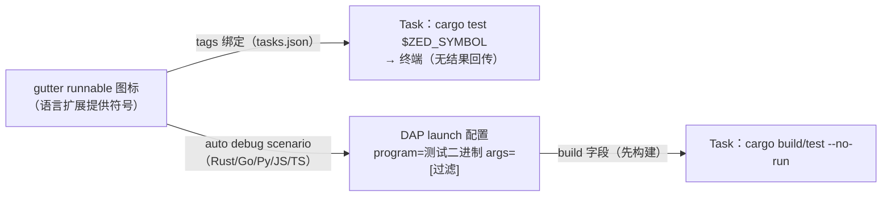

# 测试执行架构调研 — Zed 与结果协议横评（libtest JSON / vitest / service messages / DAP）

> 调研日期：2026-09-05。范围：Zed 的任务式测试执行与"无 Testing UI"取舍；各家**结构化结果协议**的横向对比与得失。
> 一手来源：zed.dev 官方文档、rust-lang/rust 源码（libtest）、vitest 官方文档、JetBrains 源码与文档。

---

## 1. Zed

### 1.1 任务系统：一切皆终端命令

Zed 官方定位（[Tasks 文档](https://zed.dev/docs/tasks)开篇原文）：

> "Zed supports ways to **spawn (and rerun) commands using its integrated terminal to output the results**."

即：Zed 的"测试执行"就是任务执行 —— `tasks.json` 模板 → `task: spawn` / `task: rerun` → **集成终端**里跑命令、看输出。没有测试树、没有用例状态、没有结果回传 API。文档明示输出处理只有终端级选项（`reveal`/`hide`/`show_summary`/`show_command`）。

要点（全部出自 [tasks 文档](https://zed.dev/docs/tasks)）：

- **模板定义**：全局 `~/.config/zed/tasks.json`、工作区 `.zed/tasks.json`、oneshot（模态框临时命令）、语言扩展提供；
- **变量插值**：`ZED_FILE` / `ZED_ROW` / `ZED_COLUMN` / `ZED_RELATIVE_FILE` / `ZED_STEM` / `ZED_SYMBOL`（面包屑末级符号，如 `mod tests > fn test_task_contexts`）/ `ZED_WORKTREE_ROOT` / `ZED_LANGUAGE` / `ZED_SELECTED_TEXT`，以及 Rust 专属 **`ZED_CUSTOM_RUST_PACKAGE`**（当前文件所属 package 名，由语言扩展注入）。支持 `${VAR:default}` 默认值语法；**变量缺失的任务从模态框过滤掉**（上下文感知的任务列表）；
- **变量缺失过滤 + `ZED_SYMBOL`** 的组合，正是"测试上下文任务"的实现方式：`cargo test $ZED_SYMBOL` / `pnpm vitest run $ZED_FILE -t $ZED_SYMBOL` 这类模板只在光标位于测试函数内时出现；
- **行为开关**：`use_new_terminal` / `allow_concurrent_runs`（rerun 时可"取消旧任务再跑"）/ `save`（运行前保存 buffer）/ `reevaluate_context`（每次 rerun 重新插值变量）；
- **VS Code 任务导入**：`.vscode/tasks.json` 的 npm/shell 任务自动转换。

### 1.2 无内建 Testing UI 的取舍

| 得 | 失 |
|---|---|
| 实现成本几乎为零：任务系统 + 终端是既有设施 | 无用例级状态（✓/✗ 装饰、测试树、失败导航都没有） |
| 输出与真实终端 100% 一致（颜色、交互、TUI 兼容） | 取消 = 杀终端进程；无法做结构化的"只重跑失败" |
| 框架无关：任何测试框架开箱即用 | 任务产出不可编程消费（无事件、无协议） |
| 用户心智简单（配置即命令） | 结果持久化/历史不存在（每次跑完即忘） |

Zed 的补位手段（仍出自官方文档）：

- **runnable 标签绑定**：任务模板可加 `tags: ["rust-test"]`，**覆盖语言扩展在行内 runnable 指示器（gutter play 图标）上的默认动作**，优先级为 工作区 tasks.json > 全局 tasks.json > 语言扩展默认（[tasks 文档 "Binding runnable tags to task templates"](https://zed.dev/docs/tasks#binding-runnable-tags-to-task-templates)）。即 **gutter 图标 → 任务** 的绑定是配置化的，但图标本身由语言扩展提供、结果不回传；
- **Code Actions 快捷执行**：`cmd-.` 触发的 code actions 把绑定任务的执行放在首位（同文档 "Keybindings to run tasks bound to runnables"）。

### 1.3 Debugger（DAP）与任务/测试的关系

[Debugger 文档](https://zed.dev/docs/debugger)要点：

- Zed 是 **DAP 客户端**，按语言挂 adapter（Rust/C++/Go/Python/JS/TS 内建，其余扩展）；
- **`build` 字段内嵌任务**：debug 配置可在启动调试器前跑一个 Zed 任务（`"build": {"command": "make", "args": [...]}` 或引用既有任务 label）—— 即"先构建再调试"是**调试配置的一部分**，复用任务系统的变量插值；
- **从测试创建调试场景**："Debug tasks are created from tests, entry points... **Automatic scenario creation is currently supported for Rust, Go, Python, JavaScript, and TypeScript**"（`debugger: start` 模态框 / **gutter 场景创建**）。Rust 的测试调试场景 = 语言扩展从 gutter 的测试符号生成 launch 配置；
- 明确引导："Running **unit tests** or a debug build of your application is a good use case for launching."；
- 配置文件：`.zed/debug.json`（工作区）与全局 `debug.json`，兼容读 `.vscode/launch.json`；launch 配置字段（`program`/`args`/`cwd`/`env`）**支持任务变量**。

**小结**：Zed 证明"任务即执行、终端即展示"的下限可用且成本极低 —— 这正是 Neeko MVP（gutter → 命令 → Task Console）的形态；Zed 连 `build` 进 DAP 配置的复用都与 Neeko M4 思路一致。但 Zed 也付出了"结果不可结构化"的代价，没有用例级反馈，这是它落后 VS Code/JetBrains 的地方。

---

## 2. 协议横评：测试结果如何结构化回传

### 2.1 libtest JSON output（Rust）

- 开关：测试二进制参数 `--format json`，**unstable**，需 `-Z unstable-options`（[rustc book Tests 章](https://doc.rust-lang.org/rustc/tests/index.html#--format-format)，tracking issue rust-lang/rust#49359）；Rust 1.70 起测试 CLI 强制稳定性，stable 工具链须设 `RUSTC_BOOTSTRAP=1`（rust-lang/rust#109044；intellij-rust `CargoTestRunState.kt:43-46` 与 rust-analyzer `test_runner.rs:66` 都这么做）；
- 权威 schema（`library/test/src/formatters/json.rs`，rust-lang/rust master）：**JSON Lines**，每行一个对象：

| 行（type） | 载荷 | 时机 |
|---|---|---|
| `{"type":"suite","event":"started","test_count":N}` | （可选 `shuffle_seed`） | 运行开始 |
| `{"type":"test","event":"started","name":"mod::test"}` | | 用例开始 |
| `{"type":"test","event":"ok"/"failed"/"ignored","name":...}` | 失败时含 `message`（断言消息）、`reason:"time limit exceeded"`；`--show-output` 或失败时含 `stdout`（捕获输出）；`exec_time` 需 `--report-time`（unstable） | 用例结束 |
| `{"type":"bench","name":...,"median":...,"deviation":...}` | | 基准 |
| `{"type":"suite","event":"ok"/"failed","passed":N,"failed":N,"ignored":N,"measured":N,"filtered_out":N}` | | 运行结束 |
| `{"type":"test","event":"discovered","name":...,"source_path":...,"start_line":...,"start_col":...,"end_line":...,"end_col":...}` | `--list --format json` | **发现**（含源码位置！） |

- 两个事实性观察：
  1. **扁平命名**：只有全限定名，无套件层级；树形需要消费方按 `::` 重建（intellij-rust `CargoTestEventsConverter` 亲手重建，`recursivelyInitContainingSuite`）；
  2. **`--list --format json` 是免费的发现通道**：连 `#[test]` 的源码行列都有 —— 但代价是必须先编译（`cargo test --no-run` 级别的编译成本）。
- **用户与它**：rust-analyzer（`test_runner.rs`）与 intellij-rust（`CargoTestEventsConverter.kt`）—— Rust 生态两大测试 UI 消费同一协议。
- 失衡点：过滤语义（`--exact` 只在完整路径时精确，裸名是子串过滤，[rustc book Filters 节](https://doc.rust-lang.org/rustc/tests/index.html#filters)）—— 与 Neeko R3 的实现期修正一致。

### 2.2 vitest JSON reporter（TS/JS）

- 选择 reporter：`--reporter=json` 或配置 `reporters: ['json', ...]`；默认**写文件** `.vitest/json/output.json`，可用 `--outputFile`/`outputFile` 配置改路径；`json`/`junit` reporter 均支持（[Reporters 文档](https://vitest.dev/guide/reporters#reporter-output)）；
- **stdout 模式的坑**（官方 WARNING 原文）："When `stdout` is enabled, the report can be **interleaved with other output** written directly to the terminal ... which can make the JSON or XML **unparsable**. **Prefer the default file output** when you need to consume the report programmatically."（[Reporters 文档](https://vitest.dev/guide/reporters#reporter-output)）
- 语义要点：报告是**运行结束才产出**的完整 JSON（非流式）—— 与 libtest JSON 的逐行流式相反；junit reporter（XML）另供 CI 消费；`--reporter=verbose` 支持 `includeTaskLocation` 输出用例位置（流式但不结构化）。
- 对编辑器集成的含义：**流式需求用 default/verbose 终端输出 + ANSI/文本解析（弱），结构化需求用 outputFile + 进程退出后读文件（强）**。Neeko 的 Task Console 观察者（`onOutput`/`onExit`）与后者天然契合。

### 2.3 JetBrains IDEA service messages（wire）/ GeneralTestEvents（内存）

- wire 格式：TeamCity 风格转义文本行（[TeamCity service messages](https://www.jetbrains.com/help/teamcity/service-messages.html)），测试事件如 `testSuiteStarted` / `testStarted(name, captureStandardOutput, locationHint, nodeId, parentNodeId, metainfo)` / `testFailed(message, details, expected, actual)` / `testFinished(duration)` / `testIgnored` / `testStdOut`；
- 内存事件：`GeneralTestEventsProcessor`（intellij-community `platform/smRunner`）——见 `test-execution-vscode-jetbrains.md` §2.2；
- 得：流式 + 树形（nodeId/parentNodeId）+ 导航（locationHint）+ diff（expected/actual）+ 进度（testCount）一站全包，且**跨框架复用**（JUnit4/5/TestNG/JS/Rust adapter 全部输出同种 wire 格式）；
- 失：协议本身靠 stdout 夹带（需要处理输出混杂、转义、ANSI），adapter 要做大量翻译（intellij-rust 的 converter 472 行）；非公开稳定 API（`ServiceMessageBuilder` 属内部包）。

### 2.4 VS Code TestMessage（内存 API，非 wire 协议）

- `TestMessage{message, expectedOutput/actualOutput, location, stackTrace}` —— **进程内对象**，`vscode.d.ts:18911`；`run.failed(test, msg)` 直接消费；
- wire 层被有意留空：扩展自己决定跑什么、怎么解析（rust-analyzer 用 libtest JSON，Jest/Vitest 扩展用自己的输出解析）；
- 得：UI 能力最强（diff 视图、stack frame 跳转都是 core 渲染）；失：跨编辑器不可复用，扩展各写一套解析。

### 2.5 DAP 与 LSP：都不是测试协议

- **DAP** 没有"测试"概念（无 discover/tests 请求、无用例状态事件）；各家测试调试都是 **"launch 测试二进制/进程 + args 过滤"**：rust-analyzer（`debug.ts:344-355`，program=测试可执行，args=executableArgs）、Zed（build task + launch 场景）、JetBrains（`--no-run` 构建 + artifact 路径启动调试器）、Neeko M4（lldb launch program=二进制 args=[name]）。DAP 只承载调试会话本身。
- **LSP** 同样没有测试标准（LSIF 是代码索引，无关）；rust-analyzer 的测试发现/执行走 **`experimental/*` 私有扩展方法**（`lsp/ext.rs:234-318`）—— 私有扩展是 LSP 生态的现实惯例。

### 2.6 得失对比表

| 协议 | 形态 | 粒度 | 流式 | 树形 | 位置信息 | diff | 生态绑定 | 主要风险 |
|---|---|---|---|---|---|---|---|---|
| libtest JSON | stdout JSON Lines | 用例 | ✅ | ❌（扁平名） | `--list` 模式有 | ❌（message 文本） | rust-analyzer + intellij-rust | unstable（需 RUSTC_BOOTSTRAP/nightly）；schema 可能变 |
| vitest JSON reporter | 文件（或 stdout，弱） | 用例+文件 | ❌（结束时一次性） | 部分（文件层级） | `includeTaskLocation` 可选 | ❌（错误文本） | vitest 官方 | stdout 混流不可解析（官方警告）；文件生命周期管理 |
| IDEA service messages | stdout 夹带文本 | 用例+套件 | ✅ | ✅ nodeId 树 | locationHint | ✅ expected/actual | JetBrains 全家桶 | 输出混杂/转义处理重；半内部 API |
| VS Code TestMessage | 进程内 API | 用例 | （事件驱动） | core 持树 | location 字段 | ✅ | 仅 VS Code | 无 wire 协议，各扩展自研解析 |
| 自研 LSP `experimental/*` | LSP 通知/请求 | 用例+树 | ✅ | ✅ | ✅ | （在 payload 里） | rust-analyzer ↔ 其 VS Code 扩展 | 私有协议，服务器↔客户端强耦合 |
| DAP | JSON-RPC | 进程级 | ✅（调试事件） | ❌ | 源码映射 | ❌ | 通用标准 | 无测试语义 |

来源：
- https://zed.dev/docs/tasks
- https://zed.dev/docs/debugger
- https://doc.rust-lang.org/rustc/tests/index.html
- https://github.com/rust-lang/rust/blob/master/library/test/src/formatters/json.rs
- https://github.com/rust-lang/rust/issues/49359
- https://github.com/rust-lang/rust/pull/109044
- https://vitest.dev/guide/reporters
- https://www.jetbrains.com/help/teamcity/service-messages.html
- https://github.com/JetBrains/intellij-community/blob/master/platform/smRunner/src/com/intellij/execution/testframework/sm/runner/GeneralTestEventsProcessor.java
- https://github.com/rust-lang/rust-analyzer/blob/master/crates/rust-analyzer/src/lsp/ext.rs
- https://github.com/rust-lang/rust-analyzer/blob/master/editors/code/src/debug.ts
