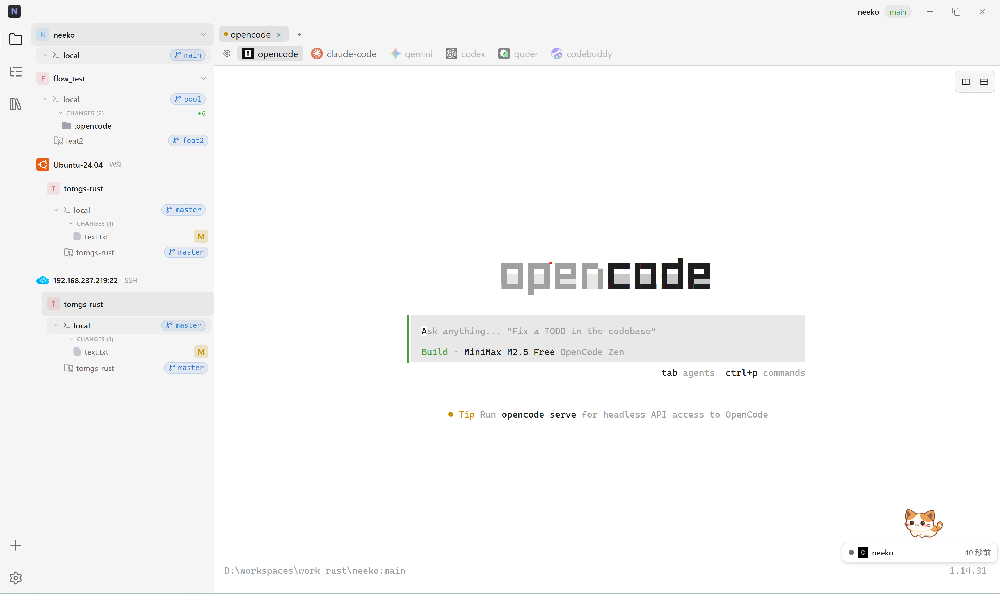
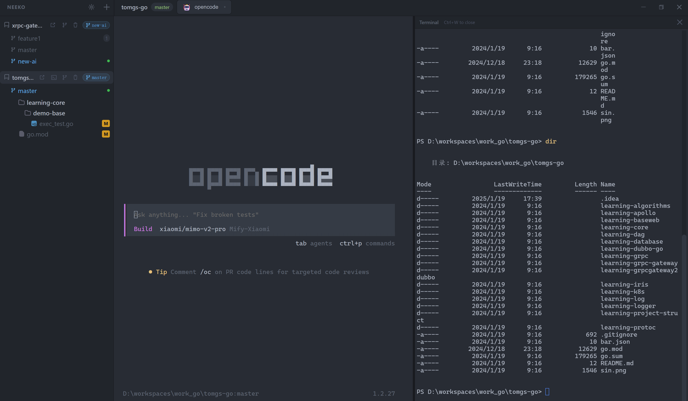

<div align="center">

# Neeko

**A Multi-Project Agent Manager Built for the AI Coding Era**

Manage all your project's AI Agent sessions in a single window — local, WSL, and SSH remote — putting opencode, claude-code, and other tools at your fingertips.

[](https://tauri.app)
[](https://rustup.rs)
[](https://react.dev)
[](LICENSE)

English | **[简体中文](README_CN.md)**

</div>

---

## What is Neeko

When you're driving multiple projects with AI Agents simultaneously, constantly switching between terminal windows, restarting Agents, and losing context breaks your development flow.

Neeko consolidates all project Agent terminals into a single desktop application: the left sidebar manages projects and Git status, while the right side shows each project's independent terminal — switch projects and your sessions stay alive.

## Preview

| Main Interface                         | Side Terminal Panel                                 |
| -------------------------------------- | --------------------------------------------------- |
|  |  |

## Features

- **Multi-Project Terminal** — Each project binds to an independent PTY terminal, sessions persist across switches, no Agent restarts needed
- **WSL Terminals** — Browse WSL distributions, select paths, and launch full PTY terminals with Agent auto-launch (Windows only)
- **SSH Remote Terminals** — Connect to remote servers via password or key-file auth, manage paths, and run Agents remotely with session caching; optionally save credentials for seamless reconnection
- **Worktree Terminals** — Each Git worktree gets its own independent terminal session with the correct working directory; click any worktree in the sidebar to open or resume its session
- **One-Click Agent Launch** — Built-in support for opencode, claude-code, qwen, gemini, codex, qoder, codebuddy — select and launch; worktree terminals automatically start the project's configured Agent
- **Side Terminal Panel** — `Ctrl+Alt+T` opens an independent side terminal next to the Agent terminal, with draggable width; when a worktree terminal is active, the side panel also opens in the worktree directory
- **One-Click IDE Launch** — Bind an IDE to each project, `Ctrl+O` or click the icon to open in VSCode / Cursor / GoLand, etc.; IDE icons displayed from built-in SVG/PNG assets
- **Git Sidebar** — View changed files as a hierarchical tree, switch branches, manage Worktrees without leaving the app; file list auto-refreshes when files change on disk
- **Diff Viewer** — Click changed files to view diffs in unified or side-by-side mode, with syntax highlighting, word-level diff, and change block navigation
- **Inline Rename** — Double-click any branch name or worktree to rename it in place; press Enter to confirm or Escape to cancel
- **Session Persistence** — Automatically restores project list, Agent, and IDE configs after restart; worktree terminal state is preserved per-project when switching between projects
- **Terminal Refresh** — `Ctrl+R` rebuilds the current terminal's DOM from the cached PTY session without losing state
- **Keyboard Driven** — `Ctrl+1~9` jump to projects, `Ctrl+Q` cycle through, `Ctrl+N` cycle through main + worktree terminals, `Ctrl+O` open IDE
- **Configurable Shell** — Choose or customize terminal Shell in settings, supports zsh / bash / fish / PowerShell, etc.
- **Configurable Font** — Select terminal font from system fonts with live preview
- **Custom Agents** — Add custom Agent CLIs and override built-in Agent commands in the Settings panel
- **Immersive Interface** — One Dark Pro color scheme, frameless window, draggable sidebar and side-terminal widths

## Getting Started

### Prerequisites

- [Node.js](https://nodejs.org/) 18+
- [Rust](https://rustup.rs/) 1.70+
- [pnpm](https://pnpm.io/) (recommended)

### Linux System Dependencies

**Ubuntu / Debian**

```bash
sudo apt install -y build-essential libwebkit2gtk-4.1-dev \
  libappindicator3-dev librsvg2-dev patchelf libgtk-3-dev
```

**Fedora**

```bash
sudo dnf install -y gcc gcc-c++ webkit2gtk4.1-devel \
  libappindicator-gtk3-devel librsvg2-devel
```

**Arch Linux**

```bash
sudo pacman -S base-devel webkit2gtk-4.1 libappindicator-gtk3 librsvg
```

### Install & Run

```bash
# Install frontend dependencies
pnpm install

# Development mode
pnpm tauri dev

# Build release
pnpm tauri build
```

## Tech Stack

| Layer                 | Technology                        |
| --------------------- | --------------------------------- |
| Application Framework | Tauri 2.0                         |
| Backend               | Rust + tokio + anyhow             |
| Frontend              | React 18 + TypeScript + Vite      |
| Terminal Backend      | portable-pty                      |
| Terminal Frontend     | @xterm/xterm 6 + @xterm/addon-fit |
| Git                   | git2-rs (libgit2 bindings)        |
| SSH                   | russh (async SSH2 client)         |
| Syntax Highlighting   | highlight.js                      |
| File Watching         | notify + notify-debouncer-mini    |
| Dialogs               | tauri-plugin-dialog               |
| Serialization         | serde + serde_json                |
| System Calls          | libc (Unix PTY echo control)      |
| Icons                 | SVG (Simple Icons, Charm Icons)   |
| Styling               | Pure CSS, One Dark Pro theme      |

## Preset Agents

opencode, claude-code, qwen, gemini, codex, qoder, codebuddy

Custom Agents can be added and built-in Agent commands can be overridden in the Settings panel.

## Preset IDEs

| ID          | Name          |
| ----------- | ------------- |
| `vscode`    | VS Code       |
| `cursor`    | Cursor        |
| `zed`       | Zed           |
| `idea`      | IntelliJ IDEA |
| `goland`    | GoLand        |
| `rustrover` | RustRover     |
| `pycharm`   | PyCharm       |

Override launch commands for each IDE or add custom IDEs in the settings panel.

## Keyboard Shortcuts

| Shortcut            | Action                                             |
| ------------------- | -------------------------------------------------- |
| `Ctrl+1` ~ `Ctrl+9` | Jump directly to project N                         |
| `Ctrl+Q`            | Cycle to next project                              |
| `Ctrl+N`            | Cycle through main terminal and worktree terminals |
| `Ctrl+Alt+T`        | Open side terminal panel                           |
| `Ctrl+W`            | Close side terminal panel                          |
| `Ctrl+R`            | Refresh/rebuild current terminal                   |
| `Ctrl+O`            | Open current project in bound IDE                  |

## License

Apache 2.0
